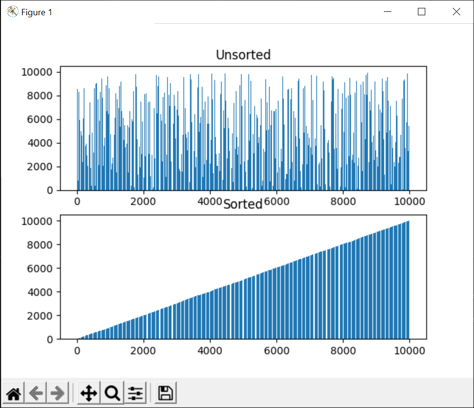

#Collection of Data Structure & Algorithms Implemented in Python

I workded on implemented theses textbook algorithms with the goal 
or having a refresher before and to work a bit more in my 
favorite language: Python.

I ran all of these experiments on a RYZE 5 3600 machine.

## Goal

My goal is to implement all the algorithms in the book "Introduction to Algorithms" by 
**Thomas H. Cormen**, **Charles E Leiserson**, **Ronald L. Rivest**, **Clifford Stein**.

So far I have implemented:

| Algo Name |
| --------- |
| Binary Search |
| Bubble Sort |
| Selection Sort |
| Linear Search |
| Graphs Depth First Search|
| Graphs Breath First Search|

## Bubble Sort

This is a plot of the time the algorithm took to finish sorting a list of
elements ranging from 100 elements to 10k elements. It show the time complexity is O(N&‌#178;)

The before and after of the array of 10K elements.

## Selection Sort

![plot] (Results/SelectionSort/selection-sort.png)

The above figure show the before and after sorting of an array of 10k elements.

Selection sort is twice as fast as Bubble sort with a time complexity of 
&fracN22 but fall 
in the category of O(N&‌#178;) quadratic time complexity. 